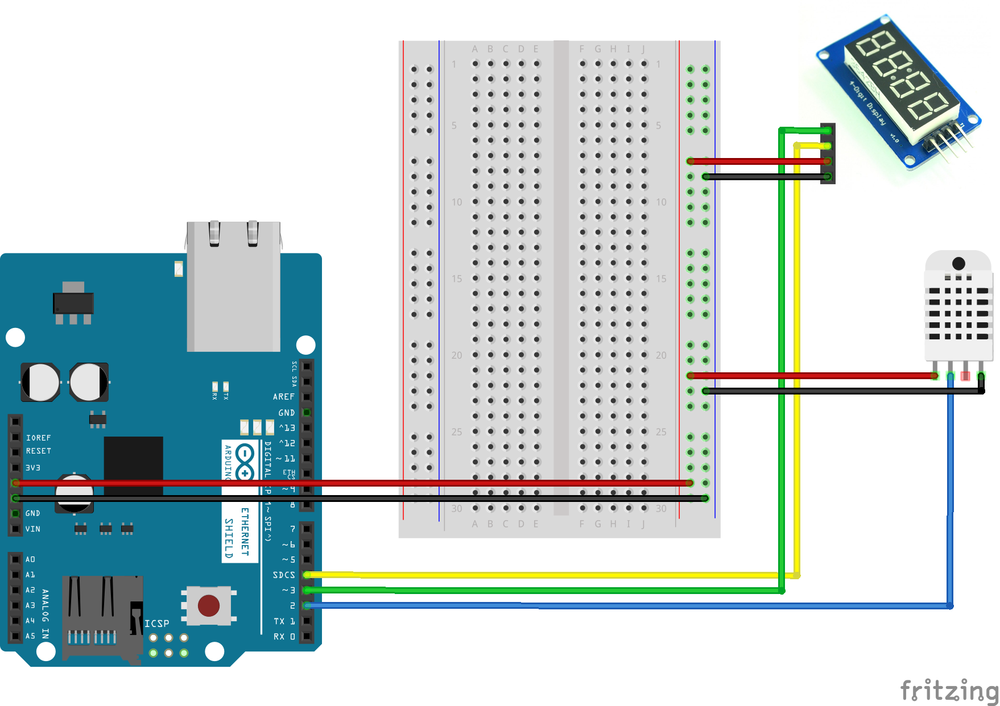

# orienteer-weather-arduino
## Description
Sending information about the weather in [Orienteer](https://github.com/OrienteerBAP/Orienteer).

## Schematic diagram

[Made in Fritzing](http://fritzing.org)

## Requirements

- SPI Library
- Ethernet Library
- [Adafruit Unified Sensor Driver](https://github.com/adafruit/Adafruit_Sensor "Adafruit Unified Sensor Driver")
- [Adafruit DHT Humidity & Temperature Unified Sensor Library](https://github.com/adafruit/DHT-sensor-library "Adafruit DHT Humidity & Temperature Unified Sensor Library")